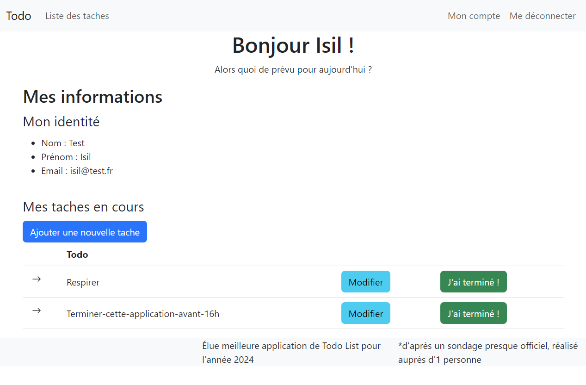

# Application TodoList avec Symfony

Une application TodoList simple et efficace créée avec Symfony. Permet aux utilisateurs de créer un compte, de se connecter, et d'accéder à leur liste de tâches à faire. L'application offre les fonctionnalités suivantes :

## Fonctionnalités

- **Authentification Utilisateur**: Les utilisateurs peuvent créer un compte et se connecter pour accéder à leur liste de tâches personnalisée.
- **Gestion de Tâches**: Les utilisateurs peuvent afficher, ajouter, modifier et supprimer des tâches de leur liste.
- **Interface Utilisateur Conviviale**: Interface utilisateur intuitive pour une expérience utilisateur optimale.

## Installation

1. Clonez ce dépôt sur votre machine locale.
2. Configurez votre base de données dans le fichier `.env`.
3. Exécutez `composer install` pour installer les dépendances.
4. Exécutez `php bin/console doctrine:migrations:migrate` pour exécuter les migrations et créer les tables de base de données.
5. Exécutez `symfony server:start` pour démarrer le serveur Symfony.

## Technologies Utilisées

- Symfony
- Doctrine ORM
- Twig
- HTML/CSS
- Bootstrap 

## Capture d'écran

